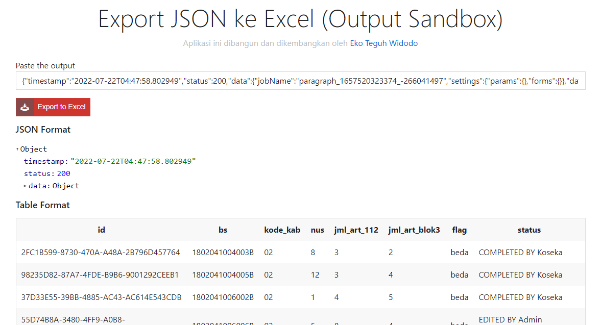

# Export Output Sandbox ke Excel

Aplikasi ini dibangun untuk mengunduh output Sandbox dalam bentuk **JSON String** menjadi bentuk Excel (xlsx). Ditampilkan juga bentuk JSON format yang lebih teratur dan juga Table Format.

Program dibangun dengan basis NodeJS dengan beberapa package manager, seperti `express`, `ejs`, `xlsx`. Untuk mencoba program secara lokal, dapat melakukan cloning project dengan perintah: 

```bash
git clone https://github.com/ekotwidodo/output-sandbox-to-excel.git
```

(Tambahan) Tambahkan folder `public/logs`

Setelah itu, install depencency dengan perintah: `npm install`

Terakhir, jalankan program dengan perintah: `npm run dev`

Buat file `.env` dan copas dari `.env.example`

Buka browser, masukkan URL: `http://localhost:<PORT>`



## INFORMASI TAMBAHAN (update)

- Penamaan file output adalah `<judul paragraf>_<timestamp>.xlsx`
- Menyimpan query dari output tersebut
- Update mekanisme penyimpanan hanya query saja, tapi file excel melalui library XLSX diambil langsung dari tabel yang terbentuk sehingga waktu download lebih cepat dan tidak harus disimpan di server
- Menambah dan merubah informasi `.env` variable dan mengimplementasikannya dalam halaman index dan informasi aplikasi
- Menambahkan informasi total records untuk memastikan data yang di-copy-paste jumlahnya sama dengan yang ada di output hasil running Sandbox
- Menambahkan informasi tentang judul tabel

## Lain-lain

Program dibangun dan dikembangkan oleh Eko Teguh Widodo.
