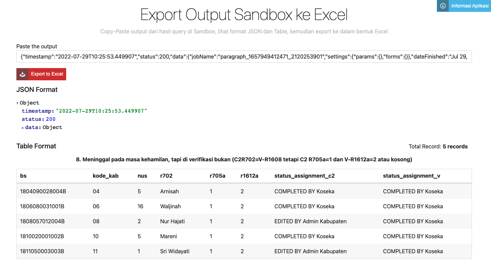

# Export JSON ke Excel (Output Sandbox)

Ini adalah program untuk mengunduh output Sandbox dalam bentuk **JSON String** menjadi bentuk Excel (xlsx). Ditampilkan juga bentuk JSON format yang lebih teratur dan juga Table Format.

Program dibangun dengan basis NodeJS dengan beberapa package manager, seperti `express`, `ejs`, `exceljs`. Untuk mencoba program secara lokal, dapat melakukan cloning project dengan perintah: 

```bash
git clone https://github.com/ekotwidodo/output-sandbox-to-excel.git
```

Setelah itu, install depencency dengan perintah: `npm install`

Terakhir, jalankan program dengan perintah: `npm run dev`

Buka browser, masukkan URL: `http://localhost:3000`



Program dikembangkan oleh Eko Teguh Widodo, apabila ada masukan bisa menghubungi secara personal. 
